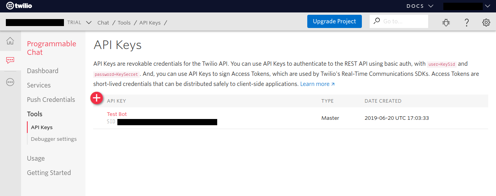
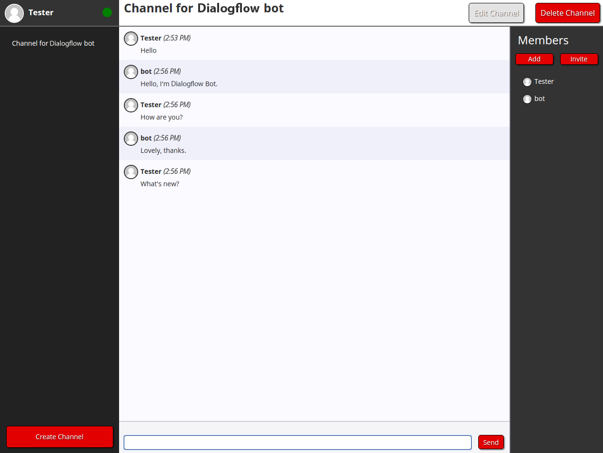

# Twilio-IP Integration

## Setup

### Prerequisites

In order, to setup this integration, you must do the following first:
- Create a [Twilio account](https://www.twilio.com/try-twilio)
- Clone the [git repo](https://OUR_GIT_REPO)

### Retrieving Credentials

1. Login to the Twilio [Dashboard](https://www.twilio.com/console). Under
Project Info, you should see your __Account SID__. Copy both this key and add it
to server.js in the twilio folder. To add them properly, set the constants
accountSid to your Account Sid you just found.
2. Proceed to the
[Programmable Chat Dashboard](https://www.twilio.com/console/chat/dashboard).
Click on the plus button to create a new chat service, and enter a new name for
it in the pop-up. The next screen, find the __Service SID__. Set the serviceSid
constant in server.js to this value.
3. Go to the [Tools tab](https://www.twilio.com/console/chat/runtime/api-keys)
in the Programmable Chat page, and click on the plus button to create a new API
key. On the next page insert the friendly name that you used to create the new
chat service, and create the keys. Set the constants apiKey and apiSecret in
server.js to the __SID__ and __Secret__ values you were just given.

## Testing

After you have setup fully setup your Twilio-IP server using the instructions in
the main README file or your own method, you can test it by doing the following
steps:
1. Download the
[IP Messaging Demo Application](https://github.com/twilio/ip-messaging-demo-js),
and unzip it.
2. Open the unzipped folder and make a copy of "credentials.example.json".
3. Rename the file to "credentials.json" and enter the following info:
     * __accountSid__ - This is your __Account SID__
     * __signingKeySid__ - This is your __API Key SID__
     * __signingKeySecret__ - This is your __API Secret__
     * __serviceSid__ - This is your __Service Instance SID__

4. In a terminal, cd to the unzipped folder and run the following commands:
    * ``npm install``
    * ``npm start``
5. Go to http://localhost:8080 in your browser, enter a name, and click the
__Log in As Guest__ button.
6. Click __Channel for Dialogflow__ bot on the left and then start talking to
your agent.

##Known Issues

Sometimes this integration gets stuck on the set-up process in Cloud run. If
this happens to you, take the container image you created for Cloud Run and
deploy the container registry image on
[Google's Kubernetes Engine](https://console.cloud.google.com/kubernetes/workload/deploy).
Make sure to add the environmental variable __GOOGLE_APPLICATION_CREDENTIALS__
to the file that contains your credentials. Instructions on how to retrieve
these are in the main README file. Next, go to the
[Workloads tab](https://console.cloud.google.com/kubernetes/workload), and then
click on your newly created workload. Click on the "Edit" button and set
the replicas value to 1 in the YAML file.  